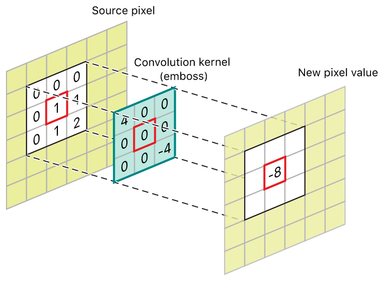
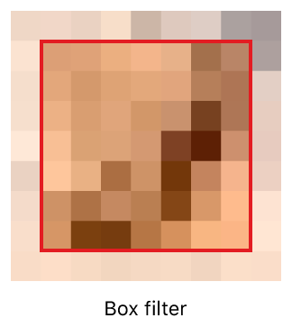
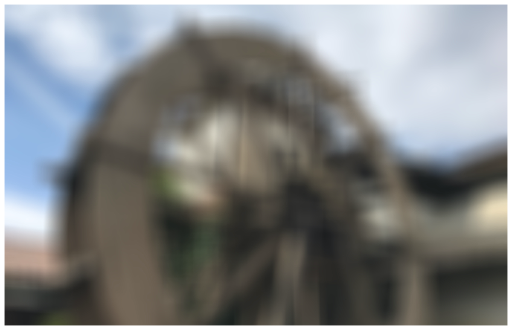
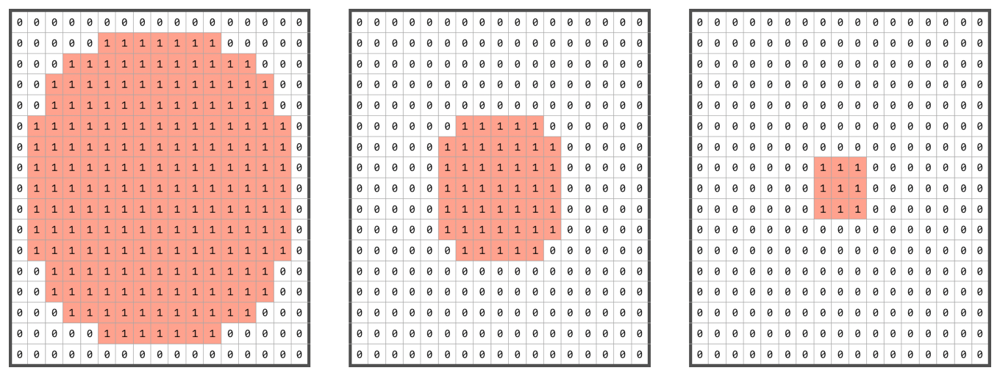

# Blurring an Image

Filter an image by convolving it with custom and high-speed kernels.

## Overview

This sample code project uses a variety of convolution techniques to blur images with custom kernels and built-in high-speed kernels. *Convolution* is a common image-processing technique that changes the value of a pixel according to the values of its surrounding pixels. Many common image filters, such as blurring, detecting edges, sharpening, and embossing, derive from convolution.

*Kernels* form the basis of convolution operations. Kernels are 1D or 2D grids of numbers that indicate the influence of a pixel's neighbors on its final value. To calculate the value of each transformed pixel, add the products of each surrounding pixel value with the corresponding kernel value. During a convolution operation, the kernel passes over every pixel in the image, repeating this procedure, and then applies the effect to the entire image.



Kernels don't need to have the same height and width, and can be 1D (that is, either the height or the width is 1) or 2D (that is, both the height and the width are greater than 1). When transforming a pixel, both dimensions must be odd numbers to center the kernel over the pixel.

The simplest kernel, known as an *identity kernel*, contains a single value: 1. The following formula shows the result when applying the kernel to the central value in a grid of nine values. It multiplies the pixel by the central value in the convolution kernel, and then multiplies the surrounding pixel values by 9. The sum of these values is 0.5.


An image remains unchanged when convolving it with an identity kernel.

## Run the Sample

To change an image, select a blur filter from the bar button item's menu of choices in the top right of the sample's navigation bar.

## Blur an Image with a 2D Kernel

A 2D kernel or box blur kernel returns the average value of the neighboring pixels. In this example, the kernel contains nine values and the result is the sum of 1 divided by 9 multiplied by each of the pixel values:


Note that the sum of the values in the convolution kernel above is 1 — that is, the kernel is *normalized*. If the sum of the values is greater than 1, the resulting image is brighter than the source. If the sum is less than 1, the resulting image is darker than the source.

A more complex blurring kernel varies the influence of pixels according to their distance from the center of the kernel, and yields a smoother blurring effect. The following kernel (based on a Hann window) is suitable for use with an integer format (for example, `ARGB8888`) convolution:

``` swift
let kernel2D: [Int16] = [
    0,    0,    0,      0,      0,      0,      0,
    0,    2025, 6120,   8145,   6120,   2025,   0,
    0,    6120, 18496,  24616,  18496,  6120,   0,
    0,    8145, 24616,  32761,  24616,  8145,   0,
    0,    6120, 18496,  24616,  18496,  6120,   0,
    0,    2025, 6120,   8145,   6120,   2025,   0,
    0,    0,    0,      0,      0,      0,      0
]
```

The example below shows the result of blurring an image using `kernel2D`:


The sample passes kernels as arrays of integers to the integer format convolution filters. To normalize an integer kernel, it passes a divisor to the function that is the sum of the elements of the kernel.

``` swift
let divisor = kernel2D.map { Int32($0) }.reduce(0, +)
```

The following example shows how to use [`vImageConvolve_ARGB8888`](https://developer.apple.com/documentation/accelerate/1515923-vimageconvolve_argb8888) to perform a convolution and populate a destination buffer with the result. Note that in addition to passing the kernel, the sample also passes the kernel's height and width using `kernelLength`.

``` swift
vImageConvolve_ARGB8888(&sourceBuffer,
                        &destinationBuffer,
                        nil,
                        0, 0,
                        &kernel2D,
                        UInt32(kernelLength),
                        UInt32(kernelLength),
                        divisor,
                        nil,
                        vImage_Flags(kvImageEdgeExtend))
```

## Blur an Image with a Separable Kernel

The `kernel2D` kernel described in the previous section is *separable*; that is, it is the *outer product* of a 1D horizontal kernel and a 1D vertical kernel. A separable kernel allows splitting of the 2D convolution into two 1D passes, resulting in faster processing times. The following formula shows the two vectors that form `kernel2D`:


The separable convolution functions in vImage work on planar buffers. The sample uses the following code to create planar source and destination buffers, and to convert the interleaved source image to planar:

``` swift
let componentCount = format.componentCount

var argbSourcePlanarBuffers: [vImage_Buffer] = (0 ..< componentCount).map { _ in
    guard let buffer = try? vImage_Buffer(width: Int(sourceBuffer.width),
                                          height: Int(sourceBuffer.height),
                                          bitsPerPixel: format.bitsPerComponent) else {
                                            fatalError("Error creating source buffers.")
    }
    
    return buffer
}

var argbDestinationPlanarBuffers: [vImage_Buffer] = (0 ..< componentCount).map { _ in
    guard let buffer = try? vImage_Buffer(width: Int(sourceBuffer.width),
                                          height: Int(sourceBuffer.height),
                                          bitsPerPixel: format.bitsPerComponent) else {
                                            fatalError("Error creating destination buffers.")
    }
    
    return buffer
}

vImageConvert_ARGB8888toPlanar8(&sourceBuffer,
                                &argbSourcePlanarBuffers[0],
                                &argbSourcePlanarBuffers[1],
                                &argbSourcePlanarBuffers[2],
                                &argbSourcePlanarBuffers[3],
                                vImage_Flags(kvImageNoFlags))
```

To learn more about working with planar buffers, see [Optimizing Image Processing Performance](https://developer.apple.com/documentation/accelerate/optimizing_image-processing_performance).

To avoid the overhead of applying convolution to the image's alpha channel, the sample uses the following code to calculate the index of the alpha channel and copy alpha information to the corresponding destination buffer:

``` swift
let alphaIndex: Int?

let littleEndian = cgImage.byteOrderInfo == .order16Little ||
                   cgImage.byteOrderInfo == .order32Little

switch cgImage.alphaInfo {
    case .first, .noneSkipFirst, .premultipliedFirst:
        alphaIndex = littleEndian ? componentCount - 1 : 0
    case .last, .noneSkipLast, .premultipliedLast:
        alphaIndex = littleEndian ? 0 : componentCount - 1
    default:
        alphaIndex = nil
}

if let alphaIndex = alphaIndex {
    do {
        try argbSourcePlanarBuffers[alphaIndex].copy(destinationBuffer: &argbDestinationPlanarBuffers[alphaIndex],
                                                     pixelSize: 1)
    } catch {
        fatalError("Error copying alpha buffer: \(error.localizedDescription).")
    }
}
```

The sample declares this 1D kernel with the following code:

``` swift
let kernel1D: [Float] = [0, 45, 136, 181, 136, 45, 0]
```

Note that the kernel for the separable convolution uses single-precision values. This allows for increased precision compared to the 2D integer convolution functions.

To apply a blur using a pair of 1D kernels, the sample calls `vImageSepConvolve_Planar8`.

``` swift
// Separable convolution pass.
 for index in 0 ..< componentCount where index != alphaIndex {
    vImageSepConvolve_Planar8(&argbSourcePlanarBuffers[index],
                              &argbDestinationPlanarBuffers[index],
                              nil,
                              0, 0,
                              kernel1D, UInt32(kernel1D.count),
                              kernel1D, UInt32(kernel1D.count),
                              0, 0,
                              vImage_Flags(kvImageEdgeExtend))
}
```

The increase in speed from using two 1D kernels instead of a single 2D kernel is significant. For each pixel, the 2D pass requires `M * N` multiplications and additions (where `M` is the number of rows and `N` is the number of columns), but each 1D pass only requires `M + N` multiplications and additions.

## Blur an Image with High-Speed Kernels

vImage provides two high-speed blurring convolutions for 8-bit images: a box filter and a tent filter. These blurs are equivalent to convolving with standard kernels, but the developer doesn't need to supply the kernel. These functions are typically faster than performing an equivalent convolution with custom kernels.

The box filter returns the average pixel value in a rectangular region that surrounds the transformed pixel.



This sample calls `vImageBoxConvolve_ARGB8888` to apply a box filter to an image.

``` swift
vImageBoxConvolve_ARGB8888(&sourceBuffer,
                           &destinationBuffer,
                           nil,
                           0, 0,
                           UInt32(kernelLength),
                           UInt32(kernelLength),
                           nil,
                           vImage_Flags(kvImageEdgeExtend))
```

Although the box filter is the fastest blur, the following example shows how it suffers from rectangular artifacts:



The tent filter returns the weighted average of pixel values in a circular region that surrounds the pixel that vImage is transforming. *Weighted average* means that the influence of pixels on the result decreases the further they are away from the transformed pixel.


The sample calls `vImageTentConvolve_ARGB8888` to apply a tent filter to an image.

``` swift
vImageTentConvolve_ARGB8888(&sourceBuffer,
                            &destinationBuffer,
                            nil,
                            0, 0,
                            UInt32(kernelLength),
                            UInt32(kernelLength),
                            nil,
                            vImage_Flags(kvImageEdgeExtend))
```

The following example shows the result of a tent filter. The result is a smoother blur, at the expense of being slightly slower to execute than the box filter.


Note that passing the [`kvImageTruncateKernel`](https://developer.apple.com/documentation/accelerate/kvimagetruncatekernel) flag to the high-speed kernels can significantly impact their performance. This flag is only necessary when vImage needs to restrict calculations to the portion of the kernel overlapping the image.

## Blur an Image with Multiple Kernels

vImage can apply multiple kernels in a single convolution. The [`vImageConvolveMultiKernel_ARGB8888`](https://developer.apple.com/documentation/accelerate/1515930-vimageconvolvemultikernel_argb88) and [`vImageConvolveMultiKernel_ARGBFFFF`](https://developer.apple.com/documentation/accelerate/1515931-vimageconvolvemultikernel_argbff) functions make it possible to specify four separate kernels—one for each channel in the image.

When using multiple kernels to apply image filters, vImage can operate on the red, green, blue, and alpha channels individually. For example, it can use multiple-kernel convolutions to resample the color channels of an image differently to compensate for the positioning of RGB phosphors on the screen. Since each of the four kernels can operate on a single channel, the vImage multiple-kernel convolution functions are available only to the interleaved image formats, `ARGB8888` and `ARGBFFFF`.

The four kernels for the convolution filters need to be the same size, but can accept padding with zeros to simulate smaller kernels. vImage is able to optimize individual passes, effectively cropping the zero padding.  

The following code creates an array of four kernels, each containing a central circle of 1s of decreasing size:

``` swift
let radius = kernelLength / 2
let diameter = (radius * 2) + 1

let kernels: [[Int16]] = (1 ... 4).map { index in
    var kernel = [Int16](repeating: 0,
                         count: diameter * diameter)
    
    for x in 0 ..< diameter {
        for y in 0 ..< diameter {
            if hypot(Float(radius - x), Float(radius - y)) < Float(radius / index) {
                kernel[y * diameter + x] = 1
            }
        }
    }
    
    return kernel
}
```

For example, with a kernel length of 17, the first three kernels from the code above contain the following values:



 The [`vImageConvolveMultiKernel_ARGB8888`](https://developer.apple.com/documentation/accelerate/1515930-vimageconvolvemultikernel_argb88) performs the convolution.

``` swift
var divisors = kernels.map { return Int32($0.reduce(0, +)) }
var biases: [Int32] = [0, 0, 0, 0]
var backgroundColor: UInt8 = 0

kernels[0].withUnsafeBufferPointer { zeroPtr in
    kernels[1].withUnsafeBufferPointer { onePtr in
        kernels[2].withUnsafeBufferPointer { twoPtr in
            kernels[3].withUnsafeBufferPointer { threePtr in
                
                var kernels = [zeroPtr.baseAddress, onePtr.baseAddress,
                               twoPtr.baseAddress, threePtr.baseAddress]
                
                _ = kernels.withUnsafeMutableBufferPointer { kernelsPtr in
                    vImageConvolveMultiKernel_ARGB8888(&sourceBuffer,
                                                       &destinationBuffer,
                                                       nil,
                                                       0, 0,
                                                       kernelsPtr.baseAddress!,
                                                       UInt32(diameter), UInt32(diameter),
                                                       &divisors,
                                                       &biases,
                                                       &backgroundColor,
                                                       vImage_Flags(kvImageEdgeExtend))
                }
            }
        }
    }
}
```

The example below shows the result of the multiple-kernel convolution. Note the color-fringing effect from applying different kernels to the different color channels.


