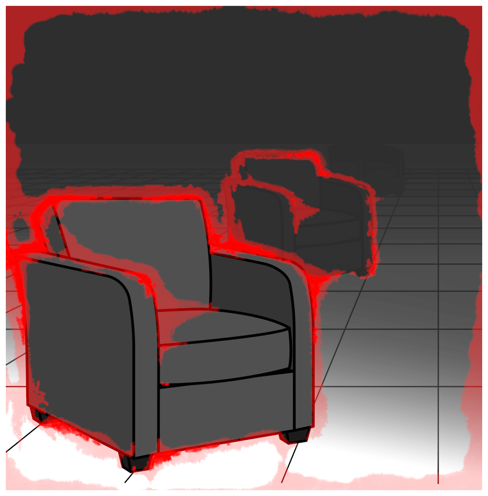

# Creating a Fog Effect Using Scene Depth

Apply virtual fog to the physical environment.

## Overview

Devices such as the second-generation iPad Pro 11-inch and fourth-generation iPad Pro 12.9-inch can use the LiDAR Scanner to calculate the distance of real-world objects from the user. In world-tracking experiences on iOS 14, ARKit provides a buffer that describes the objects' distance from the device in meters. 

This sample app uses the depth buffer to create a virtual fog effect in real time. To draw its graphics, the sample app uses a small Metal renderer. ARKit provides precise depth values for objects in the camera feed, so the sample app applies a Gaussian blur using [Metal Performance Shaders][2] (MPS) to soften the fog effect. While drawing the camera image to the screen, the renderer checks the depth texture at every pixel, and overlays a fog color based on that pixel's distance from the device. For more information on sampling textures and drawing with Metal, see [Creating and Sampling Textures][17].


## Enable Scene Depth and Run a Session

In order to avoid running an unsupported configuration, the sample app first checks whether the device supports scene depth.

``` swift
if !ARWorldTrackingConfiguration.supportsFrameSemantics(.sceneDepth) ||
    !ARWorldTrackingConfiguration.supportsFrameSemantics(.smoothedSceneDepth) {
    // Ensure that the device supports scene depth and present
    //  an error-message view controller, if not.
    let storyboard = UIStoryboard(name: "Main", bundle: nil)
    window?.rootViewController = storyboard.instantiateViewController(withIdentifier: "unsupportedDeviceMessage")
}
```

If the device running the app doesn’t support scene depth, the sample project will stop. Optionally, the app could present the user with an error message and continue the experience without scene depth.

If the device supports scene depth, the sample app creates a world-tracking configuration and enables the [`smoothedSceneDepth`][4] option on the [`frameSemantics`][6] property. 

``` swift
configuration.frameSemantics = .smoothedSceneDepth
```

Then, the sample project begins the AR experience by running the session. 

``` swift
session.run(configuration)
```

## Access the Scene's Depth

ARKit provides the depth buffer ([`depthMap`][11]) as a [`CVPixelBuffer`][5] on the current frame's [`sceneDepth`][3] or [`smoothedSceneDepth`][4] property, depending on the enabled frame semantics. This sample app visualizes [`smoothedSceneDepth`][4] by default. The raw depth values in [`sceneDepth`][3] can create the impression of a flicker effect, but the process of averaging the depth differences across frames smooths the visual into a more realistic fog effect. For debug purposes, the sample allows switching between [`smoothedSceneDepth`][4] and [`sceneDepth`][3] with an onscreen toggle.

``` swift
guard let sceneDepth = frame.smoothedSceneDepth ?? frame.sceneDepth else {
    print("Failed to acquire scene depth.")
    return
}
var pixelBuffer: CVPixelBuffer!
pixelBuffer = sceneDepth.depthMap
```

Every pixel in the depth buffer maps to a region of the visible scene, which defines that region's distance from the device in meters. Because the sample project draws to the screen using Metal, it converts the pixel buffer to a Metal texture to transfer the depth data to the GPU for rendering. 

``` swift
var texturePixelFormat: MTLPixelFormat!
setMTLPixelFormat(&texturePixelFormat, basedOn: pixelBuffer)
depthTexture = createTexture(fromPixelBuffer: pixelBuffer, pixelFormat: texturePixelFormat, planeIndex: 0)
```

To set the depth texture's Metal pixel format, the sample project calls [`CVPixelBufferGetPixelFormatType(_:)`][14] with the [`depthMap`][11] and chooses an appropriate mapping based on the result. 

``` swift
fileprivate func setMTLPixelFormat(_ texturePixelFormat: inout MTLPixelFormat?, basedOn pixelBuffer: CVPixelBuffer!) {
    if CVPixelBufferGetPixelFormatType(pixelBuffer) == kCVPixelFormatType_DepthFloat32 {
        texturePixelFormat = .r32Float
    } else if CVPixelBufferGetPixelFormatType(pixelBuffer) == kCVPixelFormatType_OneComponent8 {
        texturePixelFormat = .r8Uint
    } else {
        fatalError("Unsupported ARDepthData pixel-buffer format.")
    }
}
```

## Apply a Blur to the Depth Buffer

As a benefit of rendering its graphics with Metal, this app has at its disposal the display conveniences of MPS. The sample project uses the MPS Gaussian Blur filter to make realistic fog. When instantiating the filter, the sample project passes a `sigma` of `5` to specify a 5-pixel radius blur.
 
``` swift
blurFilter = MPSImageGaussianBlur(device: device, sigma: 5)
```

- Note: To gain performance at the cost of precision, the app can add [`MPSKernelOptionsAllowReducedPrecision`][7] to the blur filter's [`options`][8], which reduces computation time by using `half` instead of `float`. 

MPS requires input and output images that define the source and destination pixel data for the filter operation.

``` swift
let inputImage = MPSImage(texture: depthTexture, featureChannels: 1)
let outputImage = MPSImage(texture: filteredDepthTexture, featureChannels: 1)
```

The sample app passes the input and output images to the blur's `encode` function, which schedules the blur to happen on the GPU.

``` swift
blur.encode(commandBuffer: commandBuffer, sourceImage: inputImage, destinationImage: outputImage)
```

- Note: In-place MPS operations can save time, memory, and power. Since in-place MPS requires fallback code for devices that don't support it, this sample project doesn't use it. For more information on in-place operations, see [image_filters][1].

## Visualize the Blurred Depth to Create Fog

Metal renders by providing to the GPU a fragment shader that draws the app's graphics. Since the sample project renders a camera image, it packages up the camera image for the fragment shader by calling `setFragmentTexture`. 
 
``` swift
renderEncoder.setFragmentTexture(CVMetalTextureGetTexture(cameraImageY), index: 0)
renderEncoder.setFragmentTexture(CVMetalTextureGetTexture(cameraImageCbCr), index: 1)
```

Next, the sample app packages up the filtered depth texture.

``` swift
renderEncoder.setFragmentTexture(filteredDepthTexture, index: 2)
```

The sample project's GPU-side code fields the texture arguments in the order of the `index` argument. For example, the fragment shader fields the texture with index `0` above as the argument containing the suffix `texture(0)`, as shown in the example below.

``` metal
fragment half4 fogFragmentShader(FogColorInOut in [[ stage_in ]],
texture2d<float, access::sample> cameraImageTextureY [[ texture(0) ]],
texture2d<float, access::sample> cameraImageTextureCbCr [[ texture(1) ]],
depth2d<float, access::sample> arDepthTexture [[ texture(2) ]],
```

To output a rendering, Metal calls the fragment shader once for every pixel it draws to the destination. The sample project's fragment shader begins by reading the RGB value of the current pixel in the camera image. The object "`s`" is a `sampler`, which enables the shader to inspect a texture at a specific location. The value `in.texCoordCamera` refers to this pixel's relative location within the camera image.

``` metal
constexpr sampler s(address::clamp_to_edge, filter::linear);

// Sample this pixel's camera image color.
float4 rgb = ycbcrToRGBTransform(
    cameraImageTextureY.sample(s, in.texCoordCamera),
    cameraImageTextureCbCr.sample(s, in.texCoordCamera)
);
half4 cameraColor = half4(rgb);
```

By sampling the depth texture at `in.texCoordCamera`, the shader queries for depth at the same relative location that it did for the camera image, and obtains the current pixel's distance in meters from the device.

``` metal
float depth = arDepthTexture.sample(s, in.texCoordCamera);
```

To determine the amount of fog that covers this pixel, the sample app calculates a fraction using the current pixel's distance divided by the distance at which the fog effect fully saturates the scene.

``` metal
// Determine this fragment's percentage of fog.
float fogPercentage = depth / fogMax;
```

The `mix` function mixes two colors based on a percentage. The sample project passes in the RGB values, fog color, and fog percentage to create the right amount of fog for the current pixel.

``` metal
half4 foggedColor = mix(cameraColor, fogColor, fogPercentage);
```

After Metal calls the fragment shader for every pixel, the view presents the final, fogged image of the physical environment to the screen.

## Visualize Confidence Data

ARKit provides the [`confidenceMap`][10] property within [`ARDepthData`][9] to measure the accuracy of the corresponding depth data ([`depthMap`][11]). Although this sample project doesn't factor depth confidence into its fog effect, confidence data could filter out lower-accuracy depth values if the app's algorithm required it.

To provide a sense for depth confidence, this sample app visualizes confidence data at runtime using the [`confidenceDebugVisualizationEnabled`](x-source-tag://ConfidenceVisualization) in the `Shaders.metal` file. 

``` metal
// Set to `true` to visualize confidence.
bool confidenceDebugVisualizationEnabled = false;
```

When the renderer accesses the current frame's scene depth, the sample project creates a Metal texture of the [`confidenceMap`][10] to draw it on the GPU.

``` swift
pixelBuffer = sceneDepth.confidenceMap
setMTLPixelFormat(&texturePixelFormat, basedOn: pixelBuffer)
confidenceTexture = createTexture(fromPixelBuffer: pixelBuffer, pixelFormat: texturePixelFormat, planeIndex: 0)
```

While the renderer schedules its drawing, the sample project packages up the confidence texture for the GPU by calling `setFragmentTexture`. 

``` swift
renderEncoder.setFragmentTexture(CVMetalTextureGetTexture(confidenceTexture), index: 3)
```

The GPU-side code fields confidence data as the fragment shader's third texture argument.

``` metal
texture2d<uint> arDepthConfidence [[ texture(3) ]])
```

To access the confidence value of the current pixel's depth, the fragment shader samples the confidence texture at `in.texCoordCamera`. Each confidence value in this texture is a `uint` equivalent of its corresponding case in the [`ARConfidenceLevel`][16] enum.

``` metal
uint confidence = arDepthConfidence.sample(s, in.texCoordCamera).x;
```

Based on the confidence value at the current pixel, the fragment shader creates a normalized percentage of the confidence color to overlay. 

``` metal
float confidencePercentage = (float)confidence / (float)maxConfidence;
```

The sample project calls the `mix` function to blend the confidence color into the processed pixel based on the confidence percentage. 

``` metal
return mix(confidenceColor, foggedColor, confidencePercentage);
```

After Metal calls the fragment shader for every pixel, the view presents the camera image augmented with the confidence visualization.



This sample uses the color red to identify parts of the scene in which depth confidence is less than [`high`][15]. At low confidence depth values with a normalized percentage of `0`, the visualization renders solid red (`confidenceColor`). For high confidence depth values with a value of one, the `mix` call returns the unfiltered, fogged camera-image color (`foggedColor`). At medium-confidence areas of the scene, the `mix` call returns a blend of both colors that applies a reddish tint to the fogged camera-image. 

[1]:https://developer.apple.com/documentation/metalperformanceshaders/image_filters
[2]:https://developer.apple.com/documentation/metalperformanceshaders
[3]:https://developer.apple.com/documentation/arkit/arconfiguration/framesemantics/3516902-scenedepth
[4]:https://developer.apple.com/documentation/arkit/arconfiguration/framesemantics/3674208-smoothedscenedepth
[5]:https://developer.apple.com/documentation/corevideo/cvpixelbuffer-q2e
[6]:https://developer.apple.com/documentation/arkit/arconfiguration/framesemantics
[7]:https://developer.apple.com/documentation/metalperformanceshaders/mpskerneloptions/1618748-allowreducedprecision
[8]:https://developer.apple.com/documentation/metalperformanceshaders/mpskernel/1618889-options
[9]:https://developer.apple.com/documentation/arkit/ardepthdata
[10]:https://developer.apple.com/documentation/arkit/ardepthdata/3566295-confidencemap
[11]:https://developer.apple.com/documentation/arkit/ardepthdata/3566296-depthmap
[12]:https://developer.apple.com/documentation/metal/mtlpixelformat/r32float
[13]:https://developer.apple.com/documentation/corevideo/kcvpixelformattype_onecomponent8
[14]:https://developer.apple.com/documentation/corevideo/1456851-cvpixelbuffergetpixelformattype
[15]:https://developer.apple.com/documentation/arkit/arconfidencelevel/high
[16]:https://developer.apple.com/documentation/arkit/arconfidencelevel
[17]:https://developer.apple.com/documentation/metal/creating_and_sampling_textures